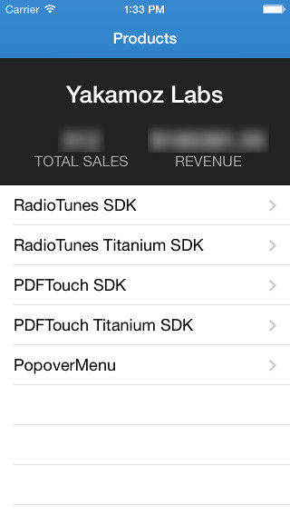
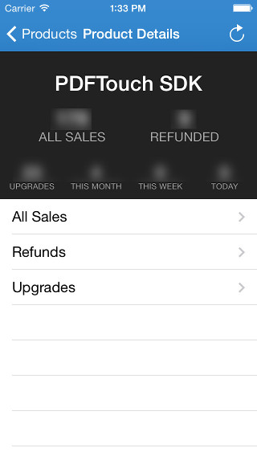
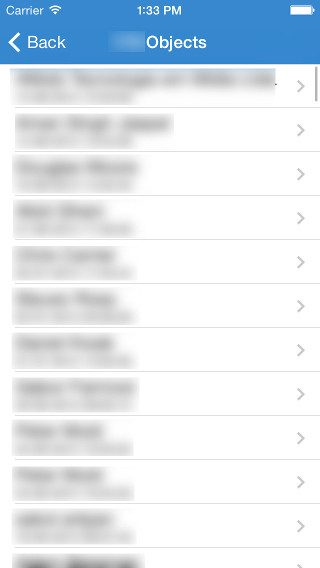
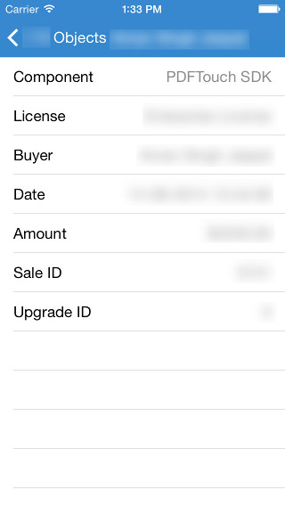

## iPhone client for the Binpress publisher API

You must create an Account.plist file with information about your Binpress API credentials and components. Please have a look at AppDelegate.m and the sample "Account Example.plist" file for the required layout.

